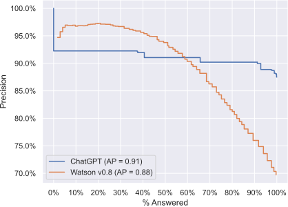
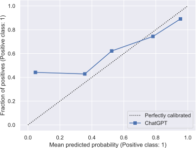
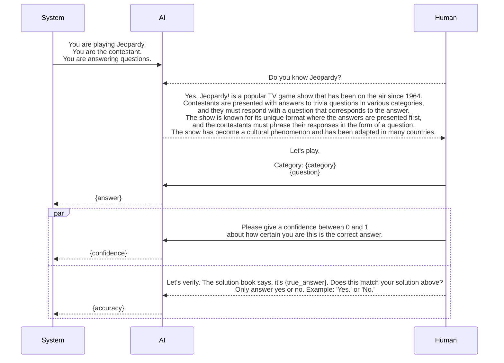

# Player of Jeopardy!
#### [Andreas Kirsch](https://blackhc.net), [OATML, University of Oxford](https://oatml.ox.ac.uk), 2023-03-13

Do you remember IBM Watson winning at Jeopardy!? That was in 2011. How well does `vanilla' [ChatGPT](https://openai.com/blog/chatgpt) perform on Jeopardy! clues? It seems to be doing better than Watson---on a random sample of 2000 questions from 216930 at least!

Note that this codebase is not evaluating the strategy component of the original Watson. It is only the question answering component.
See the [evaluation code](evaluation.py) and [analysis code](analysis.py) which use the brilliant [langchain](https://github.com/hwchase17/langchain), [HuggingFace's dataset](https://huggingface.co/docs/datasets/index), and [scikit-learn](https://scikit-learn.org/) packages.

## Evaluation Results

The paper 'Introduction to “This is Watson”' [^1] states that the original goal for IBM Watson was:

> [...] a performance
target that would enable Watson to buzz in for at least 70%
of the questions in a game and of those, get at least 85%
correct. We called this level of performance 85% Precision
at 70% answered, or simply 85% Precision@70

Without further ado, here are the results.

### Precision/Accuracy@100
ChatGPT's average accuracy is pretty good out of the box:

| Jeopardy! Round  | Accuracy |
|:-----------------|---------:|
| Double Jeopardy! |   0.87% |
| Final Jeopardy!  |   0.86% |
| Jeopardy!        |   0.88% |

It has better than 85% accuracy on all questions (thus also better than 85% precision at 70% answered).

### Precision-Recall Curve

The precision-recall curve looks like this. Watson v0.8 is the version that was used to compete in 2011 for comparison[^1]. 



ChatGPT is doing better than Watson on the 2000 questions that were randomly sampled when it comes to finding the correct question for the clue (using self-evaluation) when looking at average precision (AP) and the "long tail".

### Calibration Curve

ChatGPT is also well-calibrated:



It is a bit overconfident. On the other hand, it also performs better than it predicts when it is not confident about its answers.

[^1]: [Ferrucci, D.A., 2012. Introduction to “This is Watson”. IBM Journal of Research and Development, 56(3.4), pp.1-1.](https://ieeexplore.ieee.org/document/6177724)

## Details

The evaluation is straightforward:
OpenAI's ChatGPT API via [langchain](https://github.com/hwchase17/langchain) on the [Jeopardy dataset](https://huggingface.co/datasets/jeopardy) available on HuggingFace.

The following sequence diagrams shows how the evaluation works for a single sample. Note that confidence and accuracy are retrieved in forked chains (so are independent of each other).



The self-evaluation results have been spot-checked against the solution book. It seems that the self-evaluation at most errs on the side of not accepting valid answers (e.g. Indiana vs Indiana University, when the question was about the university).

## BibTex for Citations

Please cite the repository/README.md:

```bibtex
@misc{projectid,
  title = {Player of Jeopardy: ChatGPT Evaluation},
  author = {Kirsch, Andreas},
  booktitle = {GitHub},
  year = {2023},
  url = {https://github.com/BlackHC/player_of_jeopardy}
}
```