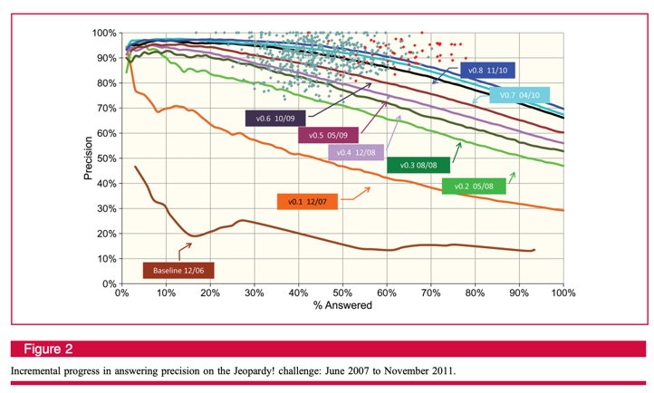

# Player of Jeopardy!

Do you remember IBM Watson winning at Jeopardy? That was in 2011. How well does `vanilla' ChatGPT do on Jeopardy? It seems to be doing better than Watson---on a random sample of 2000 questions from 216930 at least!

See [this notebook](evaluation.py) for the evaluation code.

The paper 'Introduction to “This is Watson”' [^1] states that the original goal for Watson was:

> [...] a performance
target that would enable Watson to buzz in for at least 70%
of the questions in a game and of those, get at least 85%
correct. We called this level of performance 85% Precision
at 70% answered, or simply 85% Precision@70

Without further ado, here are the results:


ChatGPT is doing better than Watson on the 2000 questions that were randomly sampled. 

Its average accuracy is also pretty good out of the box:
| round            |   accuracy |
|:-----------------|-----------:|
| Double Jeopardy! |   0.872611 |
| Final Jeopardy!  |   0.861111 |
| Jeopardy!        |   0.877691 |
and it is somewhat calibrated--albeit a bit overconfident at times. It performs better than it thinks it does when it is not confident about its answer, however.





[^1]: Ferrucci, D.A., 2012. Introduction to “This is Watson”. IBM Journal of Research and Development, 56(3.4), pp.1-1.


---

```bibtex
@article{ferrucci2012introduction,
  title={Introduction to “this is watson”},
  author={Ferrucci, David A},
  journal={IBM Journal of Research and Development},
  volume={56},
  number={3.4},
  pages={1--1},
  year={2012},
  publisher={IBM}
}
```